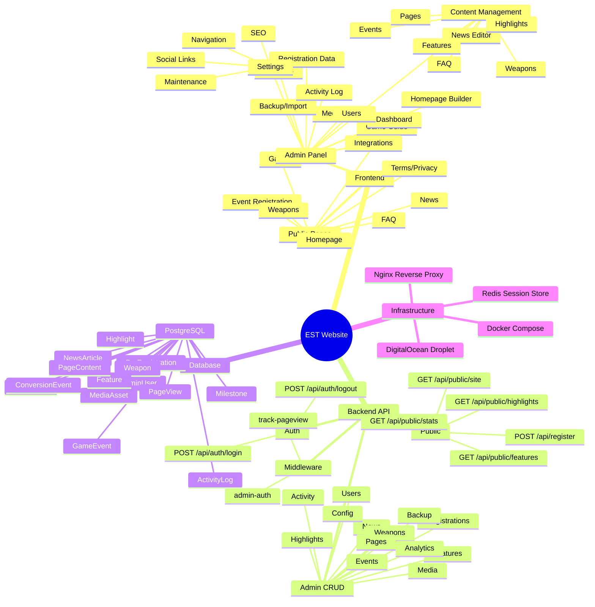
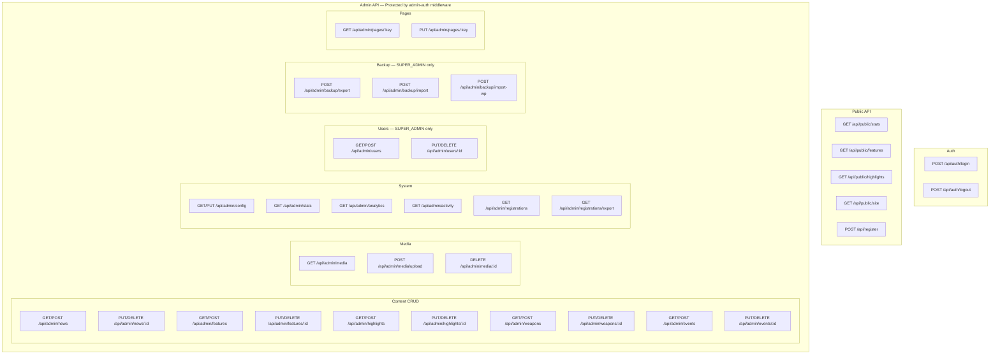
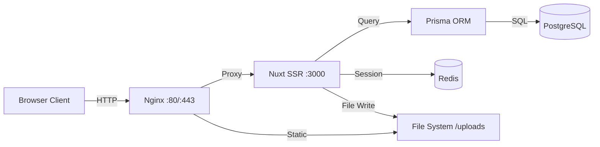

# EST-Website — Project Architecture Mindmap

## System Overview

---

## API Endpoint Matrix

---

## Data Flow

---

## Admin Frontend Architecture

| Page | Route | API Endpoint | DB Model | Actions |
|------|-------|-------------|----------|---------|
| Dashboard | `/admin` | `/admin/stats` | Multiple | View stats, charts |
| Analytics | `/admin/analytics` | `/admin/analytics` | PageView, ConversionEvent | View traffic |
| News | `/admin/news` | `/admin/news` | NewsArticle | CRUD + Rich Editor |
| Features | `/admin/features` | `/admin/features` | Feature | CRUD + MediaPicker |
| Highlights | `/admin/highlights` | `/admin/highlights` | Highlight | CRUD + MediaPicker |
| Weapons | `/admin/weapons` | `/admin/weapons` | Weapon | CRUD + MediaPicker + Stats |
| Events | `/admin/events` | `/admin/events` | GameEvent | CRUD + Hot Time |
| FAQ | `/admin/faq` | `/admin/pages/faq` | PageContent (JSON) | CRUD items |
| Pages | `/admin/pages` | `/admin/pages/:key` | PageContent | CMS static pages |
| Media | `/admin/media` | `/admin/media` | MediaAsset | Upload + Delete |
| Homepage | `/admin/homepage` | `/admin/config` | SiteConfig | Section builder |
| Registrations | `/admin/registrations` | `/admin/registrations` | PreRegistration | View + Export CSV |
| Users | `/admin/users` | `/admin/users` | AdminUser | CRUD (SUPER_ADMIN) |
| Settings | `/admin/settings` | `/admin/config` | SiteConfig | Nav, SEO, Social |
| Activity | `/admin/activity` | `/admin/activity` | ActivityLog | Audit trail |
| Backup | `/admin/backup` | `/admin/backup/*` | All tables | Export/Import JSON |
| Integrations | `/admin/integrations` | — | — | Configuration UI |
| SEO | `/admin/seo` | `/admin/config` | SiteConfig | Meta tags |
| Navigation | `/admin/menus` | `/admin/config` | SiteConfig | Menu builder |
| Theme | `/admin/appearance` | `/admin/config` | SiteConfig | Theme settings |

---

## Technology Stack

| Layer | Technology |
|-------|-----------|
| **Frontend** | Nuxt 3, Vue 3, Tailwind CSS 4, @nuxt/ui (Lucide icons) |
| **Backend** | Nitro (Node.js), H3 handlers |
| **Database** | PostgreSQL via Prisma ORM |
| **Auth** | nuxt-auth-utils (cookie sessions) |
| **Cache** | Redis |
| **i18n** | @nuxtjs/i18n (TH/EN) |
| **Rich Text** | TipTap editor |
| **Deploy** | Docker Compose + Nginx |
| **Server** | DigitalOcean Droplet (178.128.127.161) |
